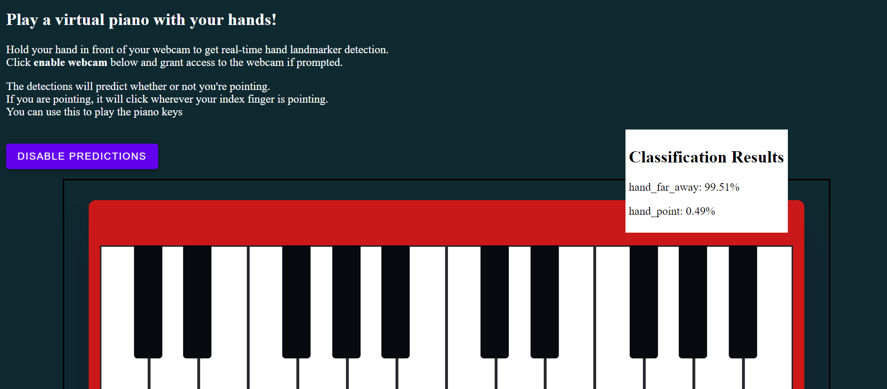
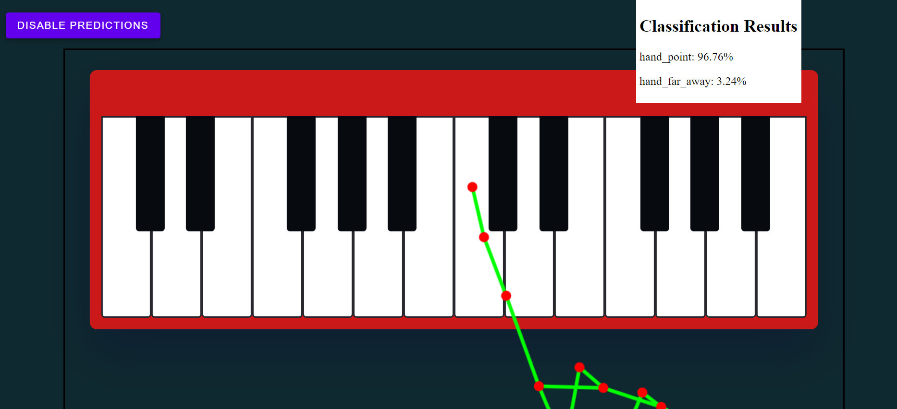

<h1 align=center>
  <br>
  <a href="https://github.com/Nelio-J/prg08-PoseDetection"></a>
  <br>
  Virtual Piano with Hand Pose Detection!
  <br>
</h1>




<h4 align="center">An app built on top of a trained model, using <a href="https://developers.google.com/mediapipe/solutions/vision/hand_landmarker" target="_blank">MediaPipe Hand Landmarker</a> to detect when you're pointing, which lets you play a Virtual Piano build in Javascript competitive.</h4>

<p align=center>
  <a href="#key-features">Key Features</a> •
  <a href="#how-to-use">How To Use</a> •
  <a href="#credits">Credits</a>
</p>



## Key Features

* Powered by MediaPipe
  - Use the power of Google's MediaPipe API to detect hand poses from your webcam in real time. This allows you to play the virtual piano by pointing at the keys.
* Open source and easy to use
  - Everything used to build this application is included in this repository. You could easily add more data to train and implement your own model.

## How To Use

To clone and run this application, you'll need [Git](https://git-scm.com). From your command line:

```bash
# Clone this repository
$ git clone https://github.com/Nelio-J/prg08-PoseDetection.git

# Go into the folder 'virtual_piano'
$ cd virtual_piano

# Open index.html
$ index.html
```

## Credits

This software uses the following open source packages:

- [MediaPipe](https://developers.google.com/mediapipe/solutions/examples)
- [ML5](https://learn.ml5js.org/#/)

